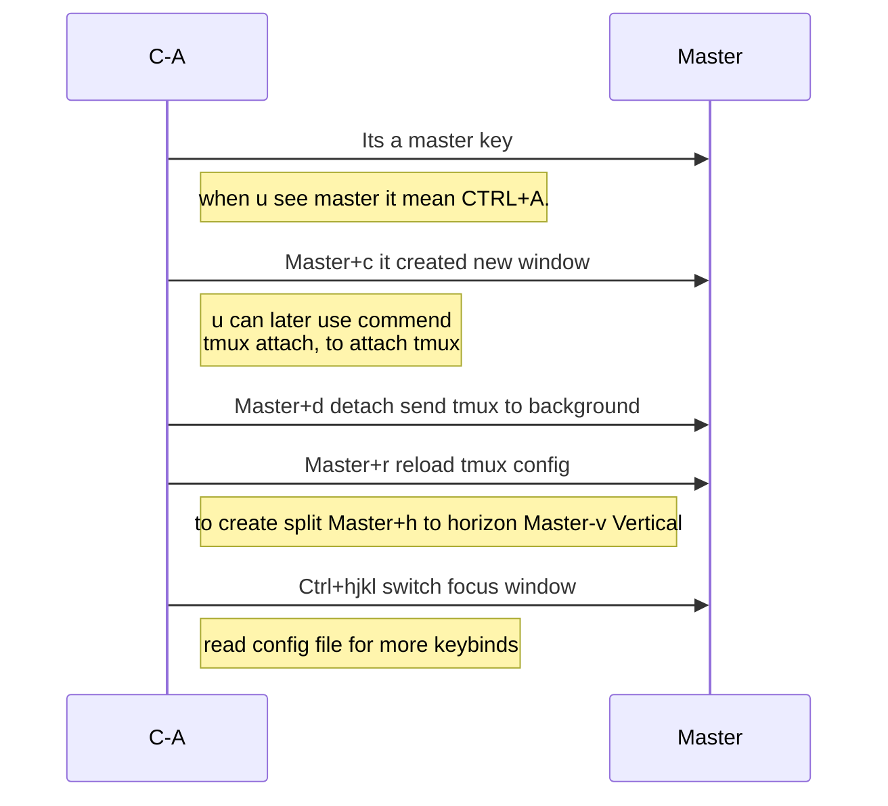
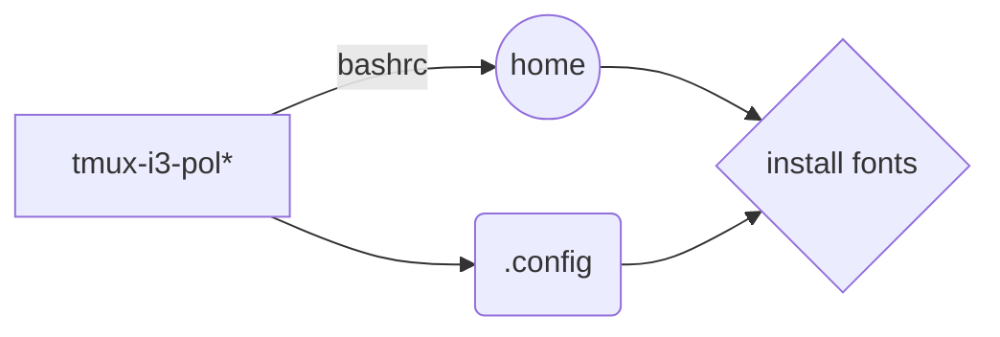

# this is my setup 
> im using arch linux i will add dependish later
# some infos

i have bashrc with vim keybinds

> u can press **arrow up** + **arrow down** for history
> there alot of **alias** read them and use them
> there a **wall function** for setting random wallpapers using **nitrogen** change default folder in function wall
> 

## Tmux keybinds

tmux is best thing u can learn to use in linux
- let show some keybinds

let show you how to manager files

